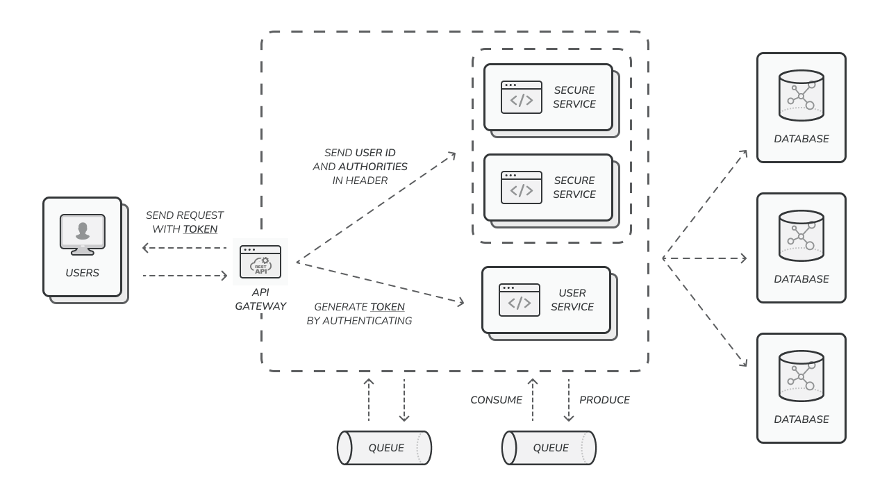

# <span style="color:#9f8170">Hamsaye</span> Backend Documentation

> **date:** 09/07/2024 
> **|**
> **version:** 1.0.0 (not tested)

> **written by:** Pouria Ghafarbeigi

## 1. Introduction

**Hamsaye** is a peer-to-peer marketplace for automated storage that connects 
people with excess space (hosts) with those who need storage (renter). 
The platform is considered the "**Airbnb of storage**" because it allows homeowners, 
businesses, and other property owners to rent out their unused spaces such as 
parking lots, warehouses, basements, and other accessible areas to people looking 
for storage solutions.

### Project Overview

This project follows a Microservice architecture and is built using Spring Boot 
technology with the Java programming language. Each service is organized within a 
specific package under the path `classpath/services/**`.

All necessary configurations for running each service are consolidated using 
Spring Cloud Config Server, located in the `config-server` package. You can find 
the configurations in the `resources/configurations` directory.

Each service is designed with a specific purpose, such as managing essential 
information for warehouse(storage) management, user management, security and customer 
authentication, payment services, installment tracking, and more.

For further insight into the project structure, please refer to second title named 
**Architecture**.

### Technologies Used

The technologies used for **Hamsaye Backend** are automatically installed on the current 
system through "docker compose file".

The technologies are listed as follows:

1. **Spring Framework**

2. **PostgreSQL Database**
   1.	postgres
   2.	pgadmin
   
3. **Mongo NoSQL Database**
   1.	mongodb
   2.	mongo-express
   
4. **Kafka Message Broker**
   1.	kafka
   2.	zookeeper

### Prerequisites

With **Docker** and **Maven**, there's no need to install any additional tools or 
libraries manually.

The required software for development includes the following:

1. **IDE** or editing and development (preferably **IntelliJ IDEA**)
    - **Professional edition** is required
   
2. **Docker**
    - Standard (Free) version
   
3. **Git**

## 2. Architecture

This project is designed with a scalable and efficient microservice architecture, 
leveraging modern technologies to handle both structured and unstructured data 
while optimizing resource usage. The system architecture focuses on flexibility, 
maintainability, and minimizing physical infrastructure demands.

To achieve these goals, the application is split into independent, loosely-coupled
microservices, each responsible for a specific domain or function. 
The communication between services is primarily handled through REST APIs or 
message queues, ensuring smooth data flow across the system.

A key aspect of the architecture is the use of Cloud Services to store and manage
large files, reducing the dependency on local storage and improving scalability.
Wherever possible, structured data is used to maintain consistency, improve query
performance, and enhance data integrity. In cases where structured data does not 
fit due to performance or inherent structural constraints, semi-structured 
(e.g., JSON, XML) and unstructured data(e.g., multimedia files, logs) are 
utilized effectively.

### System Architecture Overview

The system consists of several independent microservices, each responsible for 
specific business logic and domains. Each service is designed to be loosely 
coupled and self-contained, following the **Single Responsibility Principle**.

#### config server

Spring Cloud Config Server is a critical component in a **microservice** 
architecture that provides a centralized way to manage and serve configuration 
properties to various services within the ecosystem. It simplifies the management
of configuration across multiple environments and applications by allowing 
externalized configuration that can be updated dynamically without requiring 
service restarts.

##### 1. **Purpose and Benefits**

   Centralized Configuration Management: Spring Cloud Config Server centralizes 
   the management of configuration files, making it easier to maintain and update 
   configurations across multiple microservices. Dynamic Updates: Changes to 
   configuration files are automatically propagated to all connected services, 
   enabling dynamic configuration updates without requiring service redeployment 
   or restarts. Environment-Specific Configurations: Configurations can be managed 
   separately for different environments (e.g., development, staging, production) 
   using profile-specific files, allowing for environment-specific settings.


##### 2. **Key Components**

   * **Config Server:** The central server that serves configuration properties to 
   microservices. It retrieves configurations from a variety of sources, such as Git 
   repositories, filesystem directories, or vault services.

   * **Config Client:** Each microservice or application that consumes configuration 
   properties from the Config Server. Config clients are configured to point to the 
   Config Server and fetch necessary configuration data at startup or upon changes.


##### 3. **Configuration Sources**

   Spring Cloud Config Server supports various sources for configuration data:

   * **Git:** Commonly used as the source repository for configuration files. The 
   Config Server can pull configurations from a Git repository, supporting various 
   branches and tags.
   
   * **Filesystem:** Configuration files can be stored locally on the server's 
   filesystem and served by the Config Server.
   
   * **SVN:** Support for configurations stored in Subversion repositories.
   
   * **Vault:** Integration with HashiCorp Vault for managing sensitive data and 
   secrets.

#### discovery

Spring Cloud Discovery Server is a critical component in a microservice architecture 
that provides service registration and discovery capabilities. It allows microservices 
to dynamically register themselves and discover other services in a distributed system, 
facilitating communication and load balancing.

##### 1. **Purpose and Benefits**

   * **Service Registration:** Microservices can register themselves with the Discovery 
   Server, making them discoverable to other services within the ecosystem.
   
   * **Service Discovery:** Services can query the Discovery Server to find other services
   by name, enabling dynamic and resilient communication between services.
   
   * **Load Balancing:** With service discovery, load balancing can be managed more 
   effectively by distributing requests across available instances of a service.


##### 2. **Key Components**

   * **Discovery Server:** The central server responsible for managing the registry of 
   services. It maintains a list of registered services and their instances.
   
   * **Service Registration:** Each microservice instance registers itself with the 
   Discovery Server, providing metadata such as service name, address, and port.
   
   * **Service Client:** Each microservice that needs to discover other services queries 
   the Discovery Server to obtain the address of the desired service instance.

#### gateway

Spring Cloud Gateway is a powerful, flexible API gateway built on top of the 
**Spring Framework**. It provides a way to route requests to different microservices, 
offering features like load balancing, routing, security, and monitoring. As an essential 
component in a microservice architecture, it acts as a single entry point for clients, 
routing requests to the appropriate backend services.

##### 1. **Purpose and Benefits**

   * **Routing:** Spring Cloud Gateway routes incoming HTTP requests to specific 
   microservices based on request attributes like URL paths, headers, and parameters.
   
   * **Centralized Access:** It provides a centralized access point to various services 
   in the system, reducing the complexity of direct client-to-service communications.
   
   * **Security:** Spring Gateway can be used to enforce security policies, such as 
   authentication and authorization, at the entry point before requests reach downstream
   services.
   
   * **Load Balancing:** The gateway can distribute traffic across multiple instances of 
   microservices, balancing load and improving system resilience.
   
   * **Monitoring:** It supports metrics and logging to monitor API performance, response
   times, and other health-related data.


##### 2. **Key Features**

   * **Path-based Routing:** Routes HTTP requests to the appropriate microservice based 
   on URL paths.
   
   * **Load Balancing:** Built-in support for load balancing via Spring Cloud LoadBalancer
   or third-party tools like Netflix Ribbon (deprecated in newer versions).
   
   * **Filters:** Pre-built and custom filters allow for modifying requests and responses 
   before they are routed. For example, filters can be used for logging, authentication, 
   or rate limiting.
   
   * **Security Integration:** Easy integration with Spring Security to enforce authentication
   and authorization rules at the gateway level.
   
   * **Circuit Breaker:** Supports circuit breakers via integration with tools like 
   Resilience4j, allowing graceful degradation when services are down.
   
   * **Rate Limiting:** Implements rate-limiting strategies to control the number of requests 
   that reach backend services, improving overall system stability.
   
   * **Path Rewriting:** Supports rewriting paths or modifying request headers to ensure proper 
   routing to downstream services.

#### warehouse

This application is designed for managing information in alignment with automated inventory management.
You can use these services to enhance your warehouse operations.

The list of packages managed includes:

   * **application:** Any tools, configurations, extensions, handlers, or other components related 
   to the **warehouse application** are located in this package.

   * **storage:** Any entity or logic related to the warehouse, including warehouse images, warehouse
   rules, and warehouse specifications, is managed within this package.

   * **reservation:** A reflection of reserved warehouse information is managed in the Reserved 
   Warehouses message queue within this package, enabling the management of warehouses that are 
   available for reservation.

   * **geo:** We use a [third-party map service](https://corp.map.ir/) in the Hamsaye project. This package
   stores and manages the necessary information about warehouse geographical properties.

#### user

User information management, authentication, access control, and any other critical user-related data
are handled within this application.

The list of packages managed includes:

   * **application:** Any tools, configurations, extensions, handlers, or other components related
   to the **user application** are located in this package.

   * **authentication:** Refer to this package to check login process and creation of tokens.

   * **customer:** This package is used for customer management, customer classification and any 
   other changes.

   * **password:** This package is used for password management.

   * **role:** Role-based authentication is one of the most basic methods for managing user access 
   control.

      The architecture of this section is as follows:

      * Each user has a pre-defined Role in the system, which can be dynamically changed.
     
      * Each specific Role has a list of required permissions to access certain services 
        across all Hamsaye services.

   * **user:** The single and simple entity of the user, which contains only the necessary information
   to display a user in the simplest mode, is maintained and managed by **Spring Security** in this 
   package in order to perform authentication and authorization operations.

#### reservation

Reserving process, transaction management, payment installment and any other critical 
reservation-related data are handled within this application.

The list of packages managed includes:

   * **application:** Any tools, configurations, extensions, handlers, or other components related
   to the **reservation application** are located in this package.

   * **installment:** For each reservation, one or more installments are registered based on the 
   **Hamsaye** contract. Users can pay each installment separately by the specified due date.

   * **product:** Refer to this package for managing products in order to list the items reserved 
   in the warehouse.

   * **transaction:** This package is used to track user payments and manage banking transactions.

   * **warehouse:** For managing the warehouse reserving process, this package is used to handle 
   orders related to warehouse entities.

#### chat

A small application for facilitating communication through sending and receiving in-app messages 
and managing user messages.

The list of packages managed includes:

   * **application:** Any tools, configurations, extensions, handlers, or other components related
   to the **chat application** are located in this package.

   * **conversation:** Refer to this package for managing conversations. Each chat conversation
   starts by first message.

   * **message:** Refer to this package for managing messages, files.

   * **user:** A reflection of the necessary Hamsaye user information from the user application for 
   establishing communication and chatting.

   * **websocket:** The WebSocket configuration, including endpoints, security handlers, connections, 
   handshakes, and more, is contained within this package.

### Database Design

This project follows a relational database model using **PostgreSQL**. The design aims to support 
the core functionalities required for managing various entities related to warehouse management, 
user authentication, and financial transactions.

Each entity and its relationships are designed to ensure data integrity, scalability, and optimized
query performance.

You can refer to the ER diagram below for a visual representation of the database schema:

<div style="border: 1px solid #d3d3d3; padding: 10px; background-color: #f9f9f9;">
  <strong>Note:</strong> Install 
  <a href="https://plugins.jetbrains.com/plugin/20146-mermaid">mermaid plugin</a> 
  to see the diagrams.
</div>

- **Warehouse Database ER Diagram:** [Link to Warehouse ER Diagram](diagrams/V1.0.0/db_warehouses_er_diagram.mermaid)
- **User Database ER Diagram:** [Link to User ER Diagram](diagrams/V1.0.0/db_users_er_diagram.mermaid)
- **Reservation Database ER Diagram:** [Link to Reservation ER Diagram](diagrams/V1.0.0/db_reservations_er_diagram.mermaid)

### API Structure

Most APIs are based on **REST** and are designed using the pattern `api/v1/{endpoint}`, where v1 indicates 
the API version. If needed, the **WebSocket** protocol is utilized, with SockJS used to establish the 
connection (handshake).

#### REST APIs:
- **user service endpoints** are `/user/**, /role/**, /password/**, /customer/**, /auth/**`.
- **chat service endpoints** are `/user/**, /conversation/**, /message/**`.
- **warehouse service endpoint** is `/storage/**`.
- **reservation service endpoints** are `/reservation/**, /transaction/**, /product/**`.

#### WEB SOCKET APIs:
- **chat service endpoints** are `/user.disconnectUser, /message, /conversation.addConversation, 
  /topic/users, /conversation/{conversationId}/queue/messages`.

### Message Queue Topics

**Hamsaye** chose **Kafka Message Broker** as message queue system. **Apache Kafka** is a high-throughput, 
low-latency distributed messaging system designed for handling real-time data feeds. It is widely used for
building real-time data pipelines and streaming applications. **Kafka** is known for its durability, 
scalability, and fault-tolerance, making it a popular choice for handling large volumes of data in a 
reliable and efficient manner.

The list of topics as follows:
* **group-id:** `group-id`
  1. **storage-reservation:** Control reserved warehouse(storage) reflection or duplication.
  
  2. **topic-general-customers:** Control user information reflection or duplication such as firstname, 
  lastname, etc.
  
  3. **topic-general-customer-details:** Control customer information reflection or duplication.
  
  4. **topic-chat-users:** Managing users of **chat application** and send a websocket request.
  
  5. **topic-chat-messages:** Managing chat messaging and conversations of **chat application**
  and send a websocket request.

## 3. Setup Instructions

To ensure a smooth and efficient setup of the project, follow the instructions outlined below. This guide provides the necessary steps to configure the development environment, build the project, and get it running.

#### 1. Prerequisites

Before starting the setup process, ensure that you have the following prerequisites installed:

- **Java Development Kit (JDK):** Version 21 or higher
- **Maven:** Version 3.9 or higher (if applicable)
- **Docker**: Version 4.32 or higher (if applicable)
- **Git:** Version 2.45 or higher
- **IDE:** Recommended IntelliJ IDEA (Professional version preferred)

#### 2. Cloning the Repository

Clone the project repository from GitHub or your version control system:

```bash
git clone --branch <branch-name> https://github.com/Hamsaye-Startup/Backend.git
```

### Development Environment Setup

#### 3. Install the required Technologies

**Using Docker:**

* To install the required Technologies, use the following docker command:*

```bash
docker compose up -d
```

* To build the **Hamsaye** services using the Docker Compose file, add 
`--build` to the end of the command above.

#### 4. Building the Project

**Using Maven:**

* To build the project, use the following Maven command:

```bash
mvn clean install
```

* This will compile the source code, run tests, and package the application.

#### 5. Database Setup

**PostgreSQL Database Initialization:**

Based on which microservice you want to work with or run, navigate to its configuration file
located at address `classpath/services/config-server/src/main/resources/configurations`
and find the name of the database. Then, using the database name, create the database using
IntelliJ's query console, Docker exec console, or any method you prefer.

### Running the Project Locally

#### 6. Set the active profile

* Based on the profile name sets in `application.yml` file belongs to any application, 
set the active profile method when you want to run the project.

For example,
``` yaml
spring:
   config:
    activate:
      on-profile: test
```

#### 7. Run the project

If you want to run a microservice application, make sure run the below microservices before 
running any application: 

1. config-server
2. discovery service

If you want to use **authorize services**, you should run the below microservices too:

1. gateway service
2. user service

Then, you can test services by gateway port or without gateway port.

<div style="border: 1px solid #d3d3d3; padding: 10px; background-color: #f9f9f9;">
  <strong>Note:</strong> If your service is using <strong>REST Client</strong> 
  make sure about port and prerequisites before running.
</div>

## 4. Folder Structure

The overall structure is very simple and based on abstract entities. Generally, 
the project folder structure is created according to these abstract entities and is
divided into various categories, as illustrated in the example below:

``` text
classpath
└── services
    └── user
        ├── src
        │   ├── main
        │   │   ├── java
        │   │   │   └── com.hamsaye.user
        │   │   │       ├── users # The term should be in the plural form.
        │   │   │       │   ├── controllers # The term should be in the plural form.
        │   │   │       │   ├── services
        │   │   │       │   ├── mappers
        │   │   │       │   └── models
        │   │   │       │       └── keys # The term should be in the plural form.
        │   │   │       ├── kafka # The third-party config folder should be in singular form.
        │   │   │       └── application # The static folder -> don't change it in unnecessary situation.
        │   │   └── resources
        │   │       ├── db.migration
        │   │       │   ├── data # Data Manipulation Language (DML) commands
        │   │       │   └── structure # Data Definition Language (DDL) commands
        │   │       └── application.yml
        │   └── test
        │
        ├── Dockerfile
        └── pom.xml
```

## 5. API Documentation

This section provides comprehensive documentation for the APIs available in the project. 
The API documentation is essential for developers to understand how to interact with the 
various endpoints, including their functionalities, request parameters, response formats, 
and error handling.

#### API Documentation Links

- **Chat Service APIs:** [Link to Chat Service API Documentation](documents/V1.0.0/chat-service.md)

#### Versioning

In accordance with the previous documents, update the version to the following format:

``` text
version: 1 . 0 . 0
         │   │   └── For bug fixes in the current released version, a unit is added to the version number.
         │   └── ─── For new features in the current released version, a unit is added to the version number.
         └── ─── ─── For big updates based on company decision, a unit is added to the version number.
```

<!-- ## 6. Error Handling -->
<!-- not handled -->

## 7. Security

Security is one of the core principles in **Hamsaye**, ensuring the protection of sensitive data
and user interactions. This document outlines the methodologies and technologies implemented for
secure authentication, authorization, and communication within the system. We have chosen **JWT 
(Json Web Token)** for handling user authentication and access control due to its lightweight and
stateless nature, providing a modern, efficient, and scalable solution.

#### **1. Authentication Mechanism: Json Web Token (JWT)**

In **Hamsaye**, we use JWT for authenticating users and managing access to services. JWT is 
preferred over traditional methods like cookies, which have become outdated and less secure. JWT
ensures a stateless, secure session between clients and servers by embedding necessary claims 
(user information, roles, etc.) within the token itself.

Each JWT contains three parts:
- **Header**: Identifies the algorithm used for encryption.
- **Payload**: Contains user details, roles, and other claims.
- **Signature**: Ensures the integrity of the token, verifying that the content has not been 
  altered.

**JWT Tokens in Hamsaye**:
- **ACCESS_TOKEN**: Used for authenticating requests to protected resources. It contains the 
  necessary user information and has a short expiration time.
- **REFRESH_TOKEN**: Allows users to obtain a new access token without needing to log in again,
  typically stored as a secure cookie on the client side, named **HAMSAYE_TOKEN**.

Upon successful login, the user receives both tokens from the `api/v1/auth` endpoint. 
The **ACCESS_TOKEN** is managed by front-end developers, while the **REFRESH_TOKEN** is securely
stored on the client side.

#### **2. User Authentication Methods**

To enhance both security and user experience, we support multiple authentication methods in 
**Hamsaye**. The following methods are currently in place or planned for future versions:

1. **OTP (One-Time Password)**: Users can log in using a temporary, one-time password sent to 
   their registered device. This is the most secure method currently implemented and widely used.

2. **Fixed Password Login**: (In progress) Users will soon be able to log in with a username and
   password. This method is currently under development.

3. **Third-Party Authentication**: (Future) Authentication via external providers such as Google
   or other OAuth providers is planned for future releases.

Additionally, **Hamsaye** plans to introduce **two-factor authentication (2FA)** in future versions,
adding an extra layer of security during user login and critical operations.

#### **3. Access Control and Authorization**

In **Hamsaye**, services are classified into two main categories based on access control:
1. **Open Access**: Public services accessible to all users without authentication.
2. **Restricted Access**: Protected services requiring user authentication. Attempting to access
   these services without a valid token will result in an HTTP `403 Forbidden` response. 
   Even authenticated users will receive a `403` response if they lack sufficient permissions for
   the requested service.

**Role-Based Access Control (RBAC)** is implemented to manage access levels based on the user’s 
  role. Users are assigned predefined roles, which determine their access permissions. Currently,
  two non-deletable roles exist:
- **role_default**: Assigned to regular users and customers with basic access.
- **role_admin**: Reserved for system administrators, granting full access across all services.

#### **4. Token Flow and Gateway Integration**

When users interact with the system, their requests pass through an **API Gateway**, which acts
as a security checkpoint. The gateway extracts the **JWT Bearer Token** from the `authorization`
header of each incoming request and validates it.



- If the token is valid, the gateway forwards the request to the relevant microservice, attaching
  two key headers:
   - **X_USER_ID**: The unique identifier of the authenticated user.
   - **X_ROLE_A**: The list of the user’s permissions.

Each microservice in **Hamsaye** integrates with **Spring Security**, using a filter to extract
and verify the user’s identity and permissions. This approach allows each service to remain 
**stateless**, relying on the token for user authentication. The roles and permissions extracted
from the token are stored in **UsernamePasswordAuthentication** for each request.

#### **5. Permission Structure and Naming Conventions**

To facilitate flexible and extensible permission management, each secured API endpoint is assigned
a unique permission code. These codes are designed to reflect the functionality and behavior of 
the corresponding API. This approach ensures that permissions can be easily extended, managed, 
and understood.

For example:
- **create_warehouse**: Grants the ability to create new warehouses.
- **update_user_detail**: Grants the ability to update user information in detail.

The permissions associated with each API are checked at the gateway level to ensure that 
only authorized users can access the corresponding services.

#### **6. Future Security Enhancements**

As part of our ongoing efforts to improve security, **Hamsaye** plans to introduce additional
security features:

- **Two-Factor Authentication (2FA)**: To add a layer of security, particularly for sensitive
  operations.
- **OAuth Integration**: Planned support for external identity providers to allow users to 
  authenticate via Google, Facebook, or other third-party services.

These planned enhancements will further strengthen the security posture of the platform, 
ensuring that users' data and interactions remain protected.

### **Conclusion**

Security is central to **Hamsaye’s architecture**. By adopting JWT for authentication, role-based
access control (RBAC), and future enhancements like two-factor authentication and third-party 
OAuth integration, **Hamsaye** ensures a secure, flexible, and scalable system that protects user
data and ensures safe interactions across the platform. The stateless architecture, combined with
Spring Security and API Gateway validation, allows for robust, efficient management of user access
and permissions, providing peace of mind for users and developers alike.

<!-- ## 8. Testing -->
<!-- not handled --> 

## 9. Deployment

The deployment process for **Hamsaye** backend services is designed to be both flexible and 
efficient, allowing for smooth transitions between development, testing, and production 
environments. The system supports two primary methods of deployment: **Docker Compose** and 
**GitHub CI/CD**, ensuring that microservices are deployed consistently and with minimal manual
intervention. Below is an expanded and detailed overview of the deployment strategies used in 
**Hamsaye**.

#### **1. Docker Compose Deployment**

**Docker Compose** is a powerful tool used to define and run multi-container Docker applications.
In **Hamsaye**, this method allows for local and production deployments by managing services as 
individual containers, such as databases, brokers, and application microservices.

##### **Steps for Deploying with Docker Compose:**

1. **Create a DockerFile**:
   Each **microservice** or **application** in the system requires a **DockerFile** to define 
   the application’s environment. The **DockerFile** specifies how the application should be 
   built and run within a container. A typical **DockerFile** example is shown below:

   ```dockerfile
   # Use the official Maven image to build the app
   FROM maven:3.9.9-amazoncorretto-21 AS build
   WORKDIR /app
   COPY . /app
   RUN mvn clean package -DskipTests

   FROM amazoncorretto:21-alpine-jdk
   WORKDIR /app
   COPY --from=build /app/target/app-*.jar /app/app.jar

   EXPOSE 8056

   CMD ["java", "-jar", "/app/app.jar", "--spring.profiles.active=${SPRING_PROFILES_ACTIVE:dev}"]
   ```

    - This example demonstrates a **Java** application built with **OpenJDK**. The application
      **JAR** file is copied into the container, and port `8080` is exposed for external access.

2. **Define a Docker Compose File**:

   After creating the **DockerFile**, a **Docker Compose** file is necessary to orchestrate 
   multiple containers and set up inter-service communication. This file defines how each 
   containerized service will interact with others. Below is a sample **Docker Compose** 
   configuration:

   ```yaml
   services:
       app-service:
        build:
          context: ./services/user
          dockerfile: Dockerfile  # Ensure you point to the correct Dockerfile
        image: hamsaye/app-service:latest
        container_name: hm_app-service # Ensure you write with this format
        ports:
          - 8080:8080
        networks:
          - hamsaye_network
        environment:
          - SPRING_PROFILES_ACTIVE=dev
        depends_on:
          - discovery-service
          - postgres
          - kafka
   ```

    - In this example, two services are defined: the **app-service** and **postgres-db**. 
      The application service depends on the **PostgreSQL** database, which is also containerized.
      Ports are exposed, and environment variables are configured for the database.

3. **Handling Environment Variables**:

   When deploying using **Docker Compose**, you may need to configure environment-specific 
   variables. These variables should be defined either in the **Docker Compose** file or in a 
   separate `.env` file for security and manageability. For example:

   ```yaml
   environment:
     - SPRING_DATASOURCE_URL=jdbc:postgresql://postgres-db:5432/hamsaye_db
     - SPRING_DATASOURCE_USERNAME=admin
     - SPRING_DATASOURCE_PASSWORD=password
   ```

    - Environment variables for **Spring Boot** applications, such as database URLs and 
      credentials, should be included to ensure seamless connectivity to external resources.

4. **Using Profiles for Environment-Specific Resources**:

   In some cases, services may need to interact with environment-specific resources, such as 
   databases, messaging brokers, or external APIs. In such cases, it is recommended to use 
   **profiles** for different environments (e.g., `dev`, `prod`) to ensure the correct 
   configurations are applied. Profiles can be defined in **Spring Boot** properties and linked
   in the **Docker Compose** file.

   **Note:** Ensure that the IP addresses of external resources are replaced with the container
   names (e.g., `postgres-db`) to facilitate proper service discovery within the Docker network.

##### **Command to Build and Deploy:**

To build and deploy the **Hamsaye** services using **Docker Compose**, use the following command:

```bash
docker-compose up --build
```

- The `--build` flag ensures that the images are rebuilt before deployment, capturing any recent
  changes in the code or configuration.

---

#### **2. GitHub CI/CD Deployment**

For automated and continuous integration and delivery, **Hamsaye** utilizes **GitHub CI/CD**.
This method streamlines the deployment process by automatically building, testing, and deploying 
code changes whenever new code is pushed to a repository. It ensures consistency across all 
environments and reduces manual intervention.

##### **Setting up GitHub Actions:**

1. **GitHub Workflow Definition**:

   A typical **GitHub Actions** workflow file is created in the `.github/workflows` directory
   of your repository. The workflow defines the steps required to build and deploy the project
   automatically. Below is a basic workflow file:

   ```yaml
   name: CI/CD Pipeline

   on:
     push:
       branches:
         - main

   jobs:
     build-and-deploy:
       runs-on: ubuntu-latest
       steps:
         - name: Checkout Code
           uses: actions/checkout@v2

         - name: Set up Docker Buildx
           uses: docker/setup-buildx-action@v1

         - name: Build and Push Docker Image
           uses: docker/build-push-action@v2
           with:
             context: .
             file: ./DockerFile
             push: true
             tags: your-repo/hamsaye:latest

         - name: Deploy to Docker Compose
           run: |
             docker-compose -f docker-compose.yml up -d
   ```

    - This workflow listens for changes pushed to the **main** branch and automatically builds 
      the Docker image and deploys it using **Docker Compose**.

<!-- ## 10. Performance & Optimization -->
<!-- not handled -->

<!-- ## 11. Known Issues & Troubleshooting -->
<!-- not handled -->

## 12. Future Improvements

As the **Hamsaye** platform continues to evolve, several enhancements are planned to improve 
system functionality, scalability, and security. These improvements are aimed at addressing both
user experience and technical efficiency, ensuring that the platform remains competitive and 
adaptable to future demands.

#### **1. Two-Factor Authentication (2FA)**

One of the primary security upgrades planned for the platform is the introduction of **Two-Factor
Authentication (2FA)**. By requiring a second layer of verification—such as a one-time code sent
to a mobile device or email—**2FA** will provide enhanced protection for user accounts, especially
when accessing sensitive information or performing critical operations.

#### **2. OAuth Integration for Third-Party Authentication**

To streamline the login process and provide users with more convenient authentication methods, 
**Hamsaye** will integrate **OAuth** with popular third-party providers such as **Google** and
**Facebook**. This integration will allow users to log in using their existing accounts from 
external services, simplifying onboarding and reducing friction during authentication.

#### **3. Enhanced Role and Permission Management**

Currently, role-based access control (RBAC) in **Hamsaye** is based on predefined roles. To 
increase flexibility, future versions will offer **custom role creation** and **dynamic permission
assignment**, allowing administrators to define fine-grained access controls tailored to specific
user groups or service needs.

#### **4. Optimized Data Handling for Large Datasets**

While the platform already uses **Cloud Services** to handle large files and datasets, future 
iterations will explore further optimizations for handling **semi-structured** and **unstructured
data**. Improved indexing and search capabilities will be introduced to ensure fast retrieval and
management of large volumes of data.

#### **5. Performance Optimization of Microservices**

In the ongoing effort to improve performance, we plan to further optimize the **Microservice 
Architecture** by:

- Implementing **caching mechanisms** to reduce latency.
- Enhancing **load balancing** for better distribution of traffic.
- Investigating **event-driven architectures** for more efficient handling of asynchronous tasks.

#### **6. Full Support for WebSocket Communication**

While **WebSocket** communication has been partially implemented using **SockJS**, future releases
will include more comprehensive support for real-time interactions. This will be particularly 
useful for services requiring **instant messaging**, **notifications**, and **live data updates**,
enhancing the responsiveness of the platform.

#### **7. Continuous Security Enhancements**

Security will continue to be a top priority for **Hamsaye**. Besides **2FA** and **OAuth**, 
additional security measures such as:

- **Advanced encryption techniques** for sensitive data storage and transfer.
- **Intrusion detection systems (IDS)** to monitor and block suspicious activities.
- **Regular security audits** to ensure the platform adheres to best practices and compliance 
  standards.

#### **8. Improved User Experience (UX) and API Documentation**

To make development easier for internal teams and external developers, future updates will 
include more **comprehensive API documentation** with detailed guides, examples, and better 
**error handling** descriptions. The platform’s overall **user interface** and **user experience**
will also be enhanced for greater ease of use.

#### **9. Scalability Enhancements**

As **Hamsaye** grows, the platform will focus on improving its ability to scale horizontally. 
This will involve:

- **Container orchestration** using **Kubernetes** for efficient deployment and scaling of 
  microservices.
- Increased support for **multi-region deployments**, ensuring that the platform remains fast and
  reliable, regardless of the user's geographical location.

#### **10. AI and Machine Learning Integration**

In future versions, **Hamsaye** may integrate **AI** and **machine learning** to offer smart 
recommendations and automate certain processes, such as **predictive inventory management** or
**personalized user experiences** based on behavioral data.